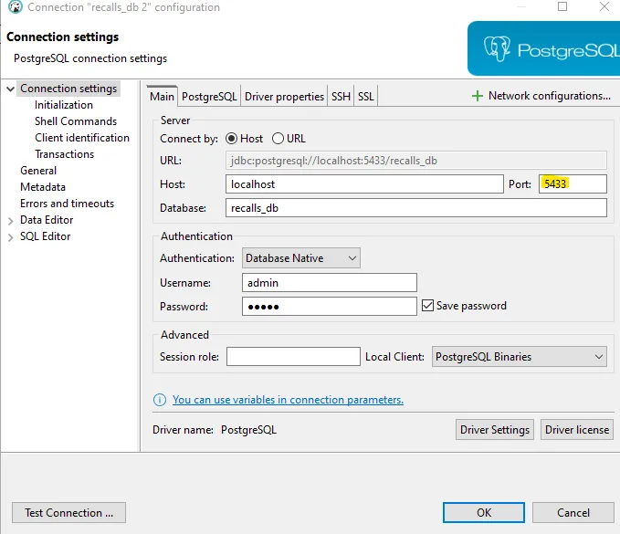

## Construindo um ETL simples com Airflow, PostgreSQL e Docker

### Pré-requisitos:

- [VS Code](https://code.visualstudio.com/download)
- [Docker](https://www.docker.com/products/docker-desktop/)
- [DBeaver ](https://dbeaver.io/download/)
- [Python](https://www.python.org/downloads/)


### Roteiro:

#### 1. Criando Ambiente Virtual
Dentro da pasta raiz do nosso diretorio vamos executar o seguinte comando
```bash  copy
python -m venv.venv
```

#### 2. Após isso vamos ativar nosso ambiente virtual criado com o comando acima
PowerShell 👇
```bash  copy
venv\Scripts\Activate
```
Cmd 👇
```bash  copy
.venv\Scripts\activate.bat
```

> **Atenção:** Todo o ambiente foi realizado com o sistema operacional Windows, em outros sistemas operacionais os códigos podem ser diferentes

#### 3. Navegar até a pasta onde iremos realizar as DAG e o ETL
```bash copy
cd airflow
```

#### 4.	Configurar a Variável de Ambiente AIRFLOW_UID
Caso já tenha o aqruivo .ambiente criado, editar ou excluir o mesmo
```bash  copy
$userId = [System.Security.Principal.WindowsIdentity]::GetCurrent().User.Value
echo "AIRFLOW_UID=$userId" > .ambiente
```

#### 5. Configurar e Iniciar o Docker Composer
```bash  copy
docker compose up airflow-init
```

#### 6. Inicializando os containers no modo desanexado
```bash copy
ocker compose up -d
```

#### 7. Verificando a IU do Airflow
Agora abre seu navegador e visite https://localhost:8080/, e devemos acessar a página de login do Airflow:
login padrão: airflow
Senha padrão: airflow

#### 8. Conectando o Dbeaver

##### 8.1. Inicializar o Terraform na pasta atual
```bash copy
terraform init
```
##### 8.2. Validar os Códigos do Terraform nos arquivos .tf
```bash copy
terraform validate
```
##### 8.3. Ajustar a formatação dos arquivos .tf
```bash copy
terraform fmt
```
##### 8.4. Gerar um plano de implantação do Terraform
```bash copy
terraform plan
```
##### 8.5. Implantar os Códigos do Terraform na cloud - assinatura MS LEARN SANDBOX
```bash copy
terraform apply
```
##### 8.6. Logar no portal do Azure e validar a criação do Azure Data Lake Storage Gen2
9. Logar no [portal.azure.com](https://portal.azure.com/) e conferir o deploy do ADLS.

##### 8.7. Remover todos os recursos implantados na cloud - assinatura MS LEARN SANDBOX
10. Destruir os recursos criados.
```bash copy
terraform destroy
```

> <b>Nota:</b> Caso queira usar o `apply` e `destroy` sem a necessidade confirmação, você pode usar a tag `-auto-approve` (use com bastante cuidado!).