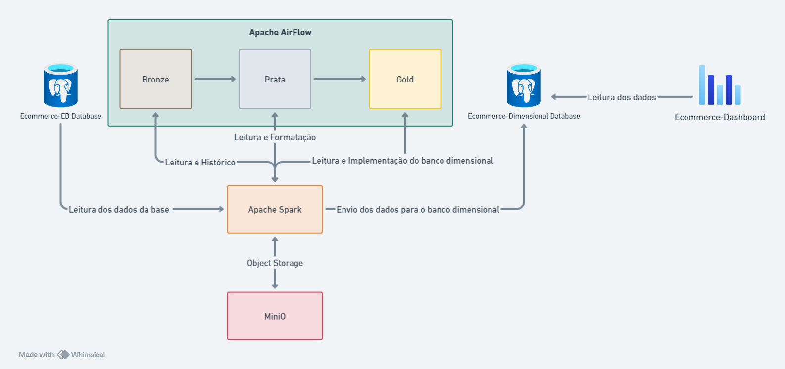

# Ecommerce &middot; [](LICENSE)  [](https://github.com/VitorM3/Ecommerce-ED/actions/workflows/deploy-mkdocs.yml)


Um modelo genérico de E-commerce para validação de conhecimentos da matéria de Engenharia de Dados.

## Começando

Essas instruções permitirão que você obtenha uma cópia do projeto em operação na sua máquina local para fins de desenvolvimento e teste.

Consulte **[Implantação](#-implanta%C3%A7%C3%A3o)** para saber como implantar o projeto.

## Desenho de Arquitetura



## Pré-requisitos

Para que o projeto funcione devidamente é necessário que seja instalado em um computador com as seguintes configurações:
Memoria Ram: 16gb
Processador: Intel core i5 6gh ou superior
Espaço em disco: 6gb

Além disto é necessário a previa instalação e configuração do docker:
https://docs.docker.com/engine/install/

## Instalação

Para realizar a instalação é rode o comando
```bash
docker compose up 
```
Este comando irá subir todos os containers que farão o processo funcionar devidamente

## Implantação

Após instalado, será necessário a configuração das conexões do apache spark e do banco base postreSql. Esta configuração poderá ser feita dentro da aba de conexões do apache airflow. Localizada em:
> admin > Connections

## Ferramentas utilizadas

<div align="center">

# [](https://www.postgresql.org/) [](https://www.python.org/) [](https://www.docker.com/) [](https://spark.apache.org/) [](https://airflow.apache.org/) [](https://code.visualstudio.com/) 


</div>

- **PostgreSQL** - Banco de dados relacional 
- **Python** - Linguagem de programação utilizada para criar os scripts de extração, transformação e carga de dados
- **Docker** - Containerização de aplicações
- **Apache Spark** - Processamento de dados em larga escala
- **Apache Airflow** - Orquestrador de tarefas
- **Visual Studio Code** - Editor de código
- **Astro CLI** - Ferramenta de linha de comando para gerenciamento de infraestrutura
- **Minio** - Armazenamento de objetos

## Colaboração
O principal intuíto deste projeto é a validação de conhecimentos adquiridos na matéria de Engenharia de Dados, por isso, a colaboração é essencial para o desenvolvimento do projeto. 

Leia abaixo como você pode colaborar com o projeto e ajudar compartilhando seu conhecimento e experiência.

### Código de Conduta
Nosso código de conduta é derivado do [Contributor Covenant](https://www.contributor-covenant.org/), versão 2.1, disponível em [CODE OF CONDUCT](CODE_OF_CONDUCT.md).

### Guia de Colaboração
Leia o [CONTRIBUTING](CONTRIBUTING.md) para entender o processo de contribuição ao desenvolvimento do nosso projeto, auxiliando com possíveis bugfixes e melhorias. 

### Boas primeiras Issues
Para se familiarizar com o projeto, você pode começar verificando as issues com o rótulo "[good first issue](https://github.com/VitorM3/Ecommerce-ED/labels/good%20first%20issue)". Estas possuem bugs ou aprimoramentos mais simples de serem resolvidos, geralmente com escopos limitados e perfeito para quem está começando a contribuir com o nosso projeto.

## Versão

O versionamento é feito com base na metodologia [SEMVER](https://semver.org/lang/pt-BR/). Explore as [tags neste repositório](https://github.com/VitorM3/Ecommerce-ED/tags) para ver todas as versões disponíveis e o [CHANGELOG.md](CHANGELOG.md) para saber mais sobre as alterações em cada versão.

## Autores

* **[Angelo José da Rosa](https://github.com/angelum23)** - *Orquestração*
* **[Danilo Formanski](https://github.com/danilean)** - *Documentação*
* **[João Victor Miotelli Vitali](https://github.com/JoaoMiotelli)** - *Orquestração*
* **[Lucas de Oliveira Alano](https://github.com/LucasAlano)** - *Orquestração*
* **[Vinicius Albino dos Santos](https://github.com/Shinguek0)** - *Data Visualization*
* **[Vitor Loch Mafei Rosa](https://github.com/VitorM3)** - *DBA*
* **[Vitor Loch Mafei Rosa](https://github.com/VitorLMR)** - *DBA*
* **[Vitor Minatto Barp](https://github.com/Minattoo)** - *Data Visualization*
* **[Yuri Lopes Machado](https://github.com/YuriLopesM)** - *Documentação*

Você também pode ver a lista de todos os [colaboradores](COLABORATORS.md) que participaram deste projeto.

## Licença

Este projeto está sob a licença MIT - veja o arquivo [LICENSE](./LICENSE) para detalhes.

## Referências

* **[Documentação Apache Spark](https://spark.apache.org/docs/latest/)**
* **[Documentação Apache Airflow](https://airflow.apache.org/docs/)**
* **[Documentação Delta Lake](https://delta.io/)**
* **[Bíblia Sagrada](https://www.bibliaonline.com.br/)**

