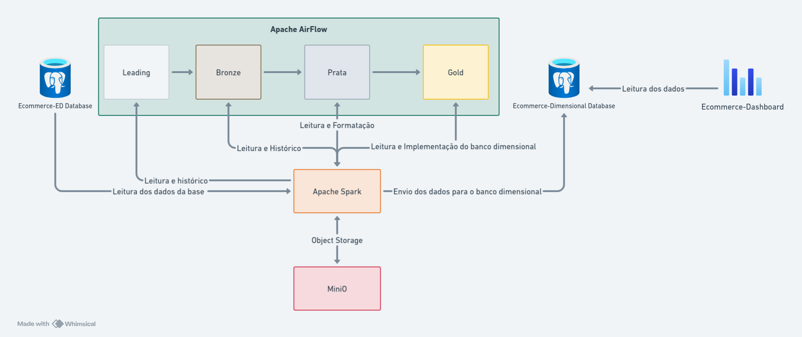

# Arquitetura do Projeto

 

 

---

## Banco relacional

A ingestão de dados é feita a partir de um banco de dados relacional, onde são armazenados os dados brutos do sistema de E-commerce. 

## ETL

Fluxo da pipeline explicado em [ETL](./etl.md)

## Ferramentas

Para saber mais sobre as ferramentas utilizadas no projeto, acesse [Ferramentas](./ferramentas.md)

## Banco dimensional

O banco dimensional é o responsável por armazenar os dados de forma otimizada para a realização de consultas analíticas. O mesmo possui as seguintes tabelas:

- **Dimensão de Categorias de Produtos**
- **Dimensão de Localização**
- **Dimensão de Vendedores**
- **Dimensão de Clientes**
- **Fato de Vendas**
